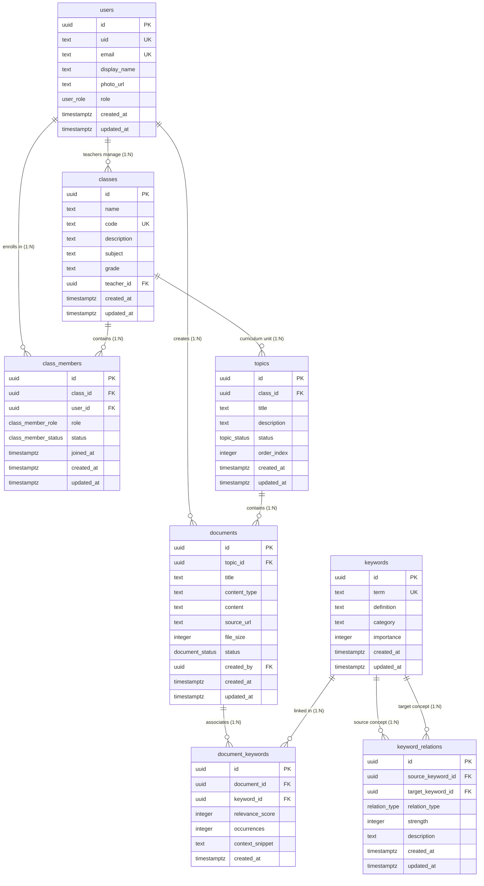

# StudyNest Core Database Schema & Architecture

## 1. Architectural Overview

StudyNest transitions to a single-source-of-truth relational architecture powered by **PostgreSQL (Cloud SQL)** and managed via **Drizzle ORM**.

- **Identity Layer (Firebase Authentication)**:
  - Identity and secure session token issuance only.
  - Client sends Firebase ID token via `Authorization: Bearer <token>`.
  - Backend verifies ID tokens using `firebase-admin` middleware (`src/middleware/auth.ts`).
  - User identity is mapped to the internal PostgreSQL `users` table via `uid`.

- **Data Persistence Layer (PostgreSQL / Cloud SQL)**:
  - Sole source of truth for all domain entities, course structures, documents, normalized keywords, and knowledge graph relations.
  - Fully normalized schema replacing JSONB-embedded keywords and tree hierarchies.
  - UUID (`gen_random_uuid()`) primary keys across all tables.
  - Foreign key constraints with explicit `ON DELETE` cascade and restrict policies.
  - Unique constraints and performance indexes on search and lookup attributes.

---

## 2. Entity-Relationship (ER) Diagram

---

## 3. Enumerated Types (Enums)

| Enum Name | Allowed Values | Description |
| :--- | :--- | :--- |
| `user_role` | `'teacher'`, `'student'`, `'admin'` | System-level permissions and access role. |
| `class_member_role` | `'teacher'`, `'student'`, `'teaching_assistant'` | Class-level membership role. |
| `class_member_status` | `'active'`, `'archived'`, `'pending'` | Class enrollment status. |
| `topic_status` | `'draft'`, `'published'`, `'archived'` | Curriculum unit lifecycle and release state. |
| `document_status` | `'draft'`, `'processing'`, `'ready'`, `'failed'`, `'archived'` | Document parsing and lifecycle status. |
| `relation_type` | `'prerequisite'`, `'related'`, `'subtopic'`, `'leads_to'`, `'generalization'` | Semantic relationship types for the Knowledge Tree graph. |

---

## 4. Tables and Fields Specification

### 4.1. `users`
Identity entity mapped to Firebase Auth.

| Column | Type | Constraints / Modifiers | Description |
| :--- | :--- | :--- | :--- |
| `id` | `UUID` | `PRIMARY KEY DEFAULT gen_random_uuid()` | Internal unique user ID |
| `uid` | `TEXT` | `NOT NULL UNIQUE` | Firebase Authentication UID |
| `email` | `TEXT` | `NOT NULL UNIQUE` | User email address |
| `display_name` | `TEXT` | `NULL` | Full name or preferred name |
| `photo_url` | `TEXT` | `NULL` | Avatar profile image URL |
| `role` | `user_role` | `NOT NULL DEFAULT 'student'` | Global application role |
| `created_at` | `TIMESTAMPTZ` | `NOT NULL DEFAULT now()` | Record creation timestamp |
| `updated_at` | `TIMESTAMPTZ` | `NOT NULL DEFAULT now()` | Last update timestamp |

**Indexes**:
- `users_uid_idx` (Unique: `uid`)
- `users_email_idx` (Unique: `email`)
- `users_role_idx` (`role`)

---

### 4.2. `classes`
Classroom or course group managed by a Teacher.

| Column | Type | Constraints / Modifiers | Description |
| :--- | :--- | :--- | :--- |
| `id` | `UUID` | `PRIMARY KEY DEFAULT gen_random_uuid()` | Unique class ID |
| `name` | `TEXT` | `NOT NULL` | Name (e.g., "Grade 10A - Biology") |
| `code` | `TEXT` | `NOT NULL UNIQUE` | Class enrollment code (e.g., "BIO-10A-2026") |
| `description` | `TEXT` | `NULL` | Syllabus or class description |
| `subject` | `TEXT` | `NOT NULL` | Subject domain (e.g., "Biology") |
| `grade` | `TEXT` | `NULL` | Grade level (e.g., "Grade 10") |
| `teacher_id` | `UUID` | `NOT NULL REFERENCES users(id) ON DELETE RESTRICT` | Primary teacher owner |
| `created_at` | `TIMESTAMPTZ` | `NOT NULL DEFAULT now()` | Record creation timestamp |
| `updated_at` | `TIMESTAMPTZ` | `NOT NULL DEFAULT now()` | Last update timestamp |

**Indexes**:
- `classes_code_idx` (Unique: `code`)
- `classes_teacher_id_idx` (`teacher_id`)
- `classes_subject_idx` (`subject`)

---

### 4.3. `class_members`
Many-to-Many join table linking Students/Members to Classes.

| Column | Type | Constraints / Modifiers | Description |
| :--- | :--- | :--- | :--- |
| `id` | `UUID` | `PRIMARY KEY DEFAULT gen_random_uuid()` | Unique membership ID |
| `class_id` | `UUID` | `NOT NULL REFERENCES classes(id) ON DELETE CASCADE` | Associated class |
| `user_id` | `UUID` | `NOT NULL REFERENCES users(id) ON DELETE CASCADE` | Enrolled user |
| `role` | `class_member_role` | `NOT NULL DEFAULT 'student'` | Member role in class |
| `status` | `class_member_status` | `NOT NULL DEFAULT 'active'` | Enrollment status |
| `joined_at` | `TIMESTAMPTZ` | `NOT NULL DEFAULT now()` | Membership join timestamp |
| `created_at` | `TIMESTAMPTZ` | `NOT NULL DEFAULT now()` | Record creation timestamp |
| `updated_at` | `TIMESTAMPTZ` | `NOT NULL DEFAULT now()` | Last update timestamp |

**Indexes & Constraints**:
- `class_members_class_user_idx` (Unique: `class_id`, `user_id`)
- `class_members_class_id_idx` (`class_id`)
- `class_members_user_id_idx` (`user_id`)
- `class_members_status_idx` (`status`)

---

### 4.4. `topics`
Curriculum topics or thematic learning units within a Class.

| Column | Type | Constraints / Modifiers | Description |
| :--- | :--- | :--- | :--- |
| `id` | `UUID` | `PRIMARY KEY DEFAULT gen_random_uuid()` | Unique topic ID |
| `class_id` | `UUID` | `NOT NULL REFERENCES classes(id) ON DELETE CASCADE` | Parent class |
| `title` | `TEXT` | `NOT NULL` | Topic title (e.g., "Cellular Respiration") |
| `description` | `TEXT` | `NULL` | Topic overview and objectives |
| `status` | `topic_status` | `NOT NULL DEFAULT 'draft'` | Publication and release state |
| `order_index` | `INTEGER` | `NOT NULL DEFAULT 0` | Display sequence order |
| `created_at` | `TIMESTAMPTZ` | `NOT NULL DEFAULT now()` | Record creation timestamp |
| `updated_at` | `TIMESTAMPTZ` | `NOT NULL DEFAULT now()` | Last update timestamp |

**Indexes**:
- `topics_class_id_idx` (`class_id`)
- `topics_class_order_idx` (`class_id`, `order_index`)
- `topics_status_idx` (`status`)

---

### 4.5. `documents`
Learning materials, lecture notes, textbook chapters, or reference documents under a Topic.

| Column | Type | Constraints / Modifiers | Description |
| :--- | :--- | :--- | :--- |
| `id` | `UUID` | `PRIMARY KEY DEFAULT gen_random_uuid()` | Unique document ID |
| `topic_id` | `UUID` | `NOT NULL REFERENCES topics(id) ON DELETE CASCADE` | Parent topic |
| `title` | `TEXT` | `NOT NULL` | Document title |
| `content_type` | `TEXT` | `NOT NULL DEFAULT 'lecture_notes'` | Type (e.g., "lecture_notes", "pdf_summary", "article") |
| `content` | `TEXT` | `NULL` | Full text or parsed markdown body |
| `source_url` | `TEXT` | `NULL` | External link or storage reference |
| `file_size` | `INTEGER` | `NULL` | Document file size in bytes |
| `status` | `document_status` | `NOT NULL DEFAULT 'ready'` | Processing and readiness state |
| `created_by` | `UUID` | `NULL REFERENCES users(id) ON DELETE SET NULL` | Author user |
| `created_at` | `TIMESTAMPTZ` | `NOT NULL DEFAULT now()` | Record creation timestamp |
| `updated_at` | `TIMESTAMPTZ` | `NOT NULL DEFAULT now()` | Last update timestamp |

**Indexes**:
- `documents_topic_id_idx` (`topic_id`)
- `documents_created_by_idx` (`created_by`)
- `documents_status_idx` (`status`)

---

### 4.6. `keywords`
Normalized scientific / curriculum vocabulary terms. Replaces embedded JSON arrays.

| Column | Type | Constraints / Modifiers | Description |
| :--- | :--- | :--- | :--- |
| `id` | `UUID` | `PRIMARY KEY DEFAULT gen_random_uuid()` | Unique keyword ID |
| `term` | `TEXT` | `NOT NULL UNIQUE` | Term name (e.g., "ATP Synthase", "Krebs Cycle") |
| `definition` | `TEXT` | `NULL` | Canonical definition |
| `category` | `TEXT` | `NULL` | Category (e.g., "Enzymes", "Processes", "Organelles") |
| `importance` | `INTEGER` | `NOT NULL DEFAULT 1` | Pedagogical weight / priority (1–5) |
| `created_at` | `TIMESTAMPTZ` | `NOT NULL DEFAULT now()` | Record creation timestamp |
| `updated_at` | `TIMESTAMPTZ` | `NOT NULL DEFAULT now()` | Last update timestamp |

**Indexes**:
- `keywords_term_idx` (Unique: `term`)
- `keywords_category_idx` (`category`)
- `keywords_importance_idx` (`importance`)

---

### 4.7. `document_keywords`
Many-to-Many association connecting Documents and Keywords with context relevance.

| Column | Type | Constraints / Modifiers | Description |
| :--- | :--- | :--- | :--- |
| `id` | `UUID` | `PRIMARY KEY DEFAULT gen_random_uuid()` | Unique association ID |
| `document_id` | `UUID` | `NOT NULL REFERENCES documents(id) ON DELETE CASCADE` | Source document |
| `keyword_id` | `UUID` | `NOT NULL REFERENCES keywords(id) ON DELETE CASCADE` | Associated keyword |
| `relevance_score` | `INTEGER` | `NOT NULL DEFAULT 100` | Confidence/relevance score (0–100) |
| `occurrences` | `INTEGER` | `NOT NULL DEFAULT 1` | Occurrence count within the document |
| `context_snippet` | `TEXT` | `NULL` | Sentence excerpt illustrating usage |
| `created_at` | `TIMESTAMPTZ` | `NOT NULL DEFAULT now()` | Record creation timestamp |

**Indexes & Constraints**:
- `document_keywords_doc_kw_idx` (Unique: `document_id`, `keyword_id`)
- `document_keywords_document_id_idx` (`document_id`)
- `document_keywords_keyword_id_idx` (`keyword_id`)

---

### 4.8. `keyword_relations`
Knowledge Graph / Ontology relationships between keywords. Replaces JSON-encoded knowledge trees.

| Column | Type | Constraints / Modifiers | Description |
| :--- | :--- | :--- | :--- |
| `id` | `UUID` | `PRIMARY KEY DEFAULT gen_random_uuid()` | Unique relation ID |
| `source_keyword_id` | `UUID` | `NOT NULL REFERENCES keywords(id) ON DELETE CASCADE` | Origin keyword in graph |
| `target_keyword_id` | `UUID` | `NOT NULL REFERENCES keywords(id) ON DELETE CASCADE` | Destination keyword in graph |
| `relation_type` | `relation_type` | `NOT NULL DEFAULT 'related'` | Semantic link type |
| `strength` | `INTEGER` | `NOT NULL DEFAULT 1` | Connection weight / depth |
| `description` | `TEXT` | `NULL` | Pedagogical explanation of relationship |
| `created_at` | `TIMESTAMPTZ` | `NOT NULL DEFAULT now()` | Record creation timestamp |
| `updated_at` | `TIMESTAMPTZ` | `NOT NULL DEFAULT now()` | Last update timestamp |

**Indexes & Constraints**:
- `keyword_relations_no_self_link` (`CHECK (source_keyword_id != target_keyword_id)`)
- `keyword_relations_src_tgt_type_idx` (Unique: `source_keyword_id`, `target_keyword_id`, `relation_type`)
- `keyword_relations_source_id_idx` (`source_keyword_id`)
- `keyword_relations_target_id_idx` (`target_keyword_id`)
- `keyword_relations_type_idx` (`relation_type`)

---

## 5. Architectural Design Rationale

### 5.1. Why `Keyword` is Canonical
1. **Pedagogical Reusability**: In an educational curriculum, scientific concepts (such as *Mitochondria*, *Cell Membrane*, or *Newton's Second Law*) appear across multiple lessons, chapters, and grade levels.
2. **Eliminating Redundancy**: Storing keywords inside documents or with embedded `document_id` creates duplicate concept records with conflicting definitions.
3. **Cross-Document Semantic Indexing**: A canonical dictionary allows student performance analytics to aggregate keyword mastery across all classes and assessments.
4. **Graph Anchoring**: The Knowledge Graph ontology links canonical concepts rather than ephemeral document excerpts.

### 5.2. Why `DocumentKeyword` is Required
1. **Document–Concept Decoupling**: Acts as a true many-to-many join entity with document-specific metadata.
2. **Context-Specific Relevance**: Stores `relevance_score` (0–100) and `occurrences` indicating the prominence of that concept in that specific reading.
3. **Evidence Snippets**: Houses `context_snippet` excerpts showing exact contextual citations without mutating the canonical keyword definition.
4. **Orphan Safety**: When a document is deleted, only its `document_keywords` join records are removed—the canonical keyword and its graph relationships remain intact.

### 5.3. Why the Knowledge Graph Uses `KeywordRelation`
1. **Replaces Monolithic JSON Trees**: Storing trees as nested JSON blobs prevents relational queries, dynamic subgraph filtering, and multi-parent graphs (DAGs).
2. **Typed Directed Ontology**: Supports semantic edge classifications (`prerequisite`, `subtopic`, `related`, `leads_to`, `generalization`) with numerical connection `strength`.
3. **Cycle & Self-Link Safety**: Constrained by `CHECK (source_keyword_id != target_keyword_id)` and unique compound keys `(source_keyword_id, target_keyword_id, relation_type)`.
4. **Relational Graph Traversal**: Allows SQL recursive common table expressions (CTEs) to extract prerequisite paths and subtrees in a single fast query.

---

## 6. Cascade & Deletion Behavior Matrix

| Foreign Key Relationship | Parent Table | Child Table | On Delete Action | Rationale |
| :--- | :--- | :--- | :--- | :--- |
| `classes.teacher_id ➔ users.id` | `users` | `classes` | `RESTRICT` | Prevents deleting teacher accounts while courses remain active. |
| `class_members.class_id ➔ classes.id` | `classes` | `class_members` | `CASCADE` | Deleting a class removes enrollment rosters. |
| `class_members.user_id ➔ users.id` | `users` | `class_members` | `CASCADE` | Deleting a user cleans up their class memberships. |
| `topics.class_id ➔ classes.id` | `classes` | `topics` | `CASCADE` | Removing a class deletes its curriculum topics. |
| `documents.topic_id ➔ topics.id` | `topics` | `documents` | `CASCADE` | Removing a topic deletes associated documents. |
| `documents.created_by ➔ users.id` | `users` | `documents` | `SET NULL` | Preserves learning documents if the author account is deleted. |
| `document_keywords.document_id ➔ documents.id` | `documents` | `document_keywords` | `CASCADE` | Deleting a document removes associations. |
| `document_keywords.keyword_id ➔ keywords.id` | `keywords` | `document_keywords` | `CASCADE` | Deleting a canonical keyword removes join links. |
| `keyword_relations.source_keyword_id ➔ keywords.id` | `keywords` | `keyword_relations` | `CASCADE` | Removing a keyword cleans up outgoing graph edges. |
| `keyword_relations.target_keyword_id ➔ keywords.id` | `keywords` | `keyword_relations` | `CASCADE` | Removing a keyword cleans up incoming graph edges. |

---

## 7. Migration Strategy & Cloud SQL Deployment Compatibility

1. **Schema Definition**: Managed via Drizzle ORM in `src/db/schema.ts`.
2. **Versioned SQL Migrations**: Generated with `drizzle-kit generate` into sequential files under `drizzle/` (`0000_*.sql`, `0001_*.sql`).
3. **Execution Pipeline**: `src/db/migrate.ts` applies migrations deterministically with error-tolerant idempotency.
4. **Environment Portability**:
   - Connection resolution defaults to standard variables (`SQL_HOST`, `SQL_PORT`, `SQL_USER`, `SQL_PASSWORD`, `SQL_DB_NAME`).
   - Compatible with local PostgreSQL, Cloud SQL Developer Edition, and production Cloud SQL Auth Proxy Unix sockets.
5. **Connection Pooling**: Cached `pg.Pool` in `src/db/index.ts` with pool-level error handling to prevent idle socket drop crashes during serverless scaling.

